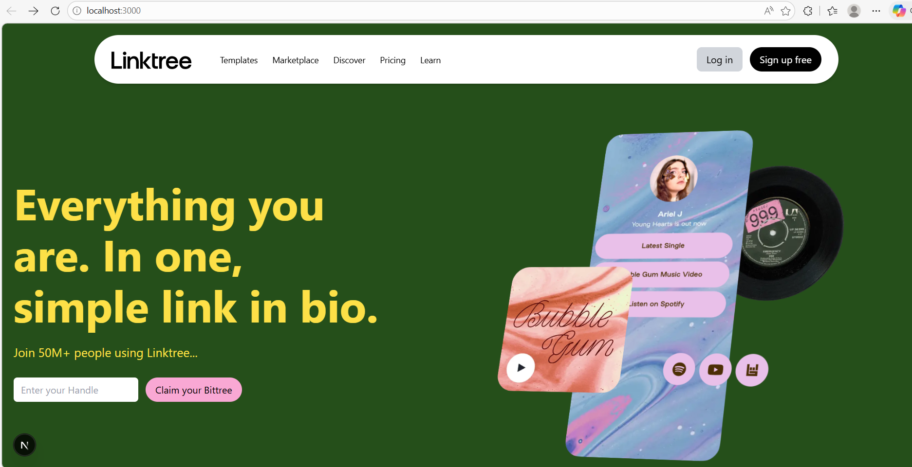
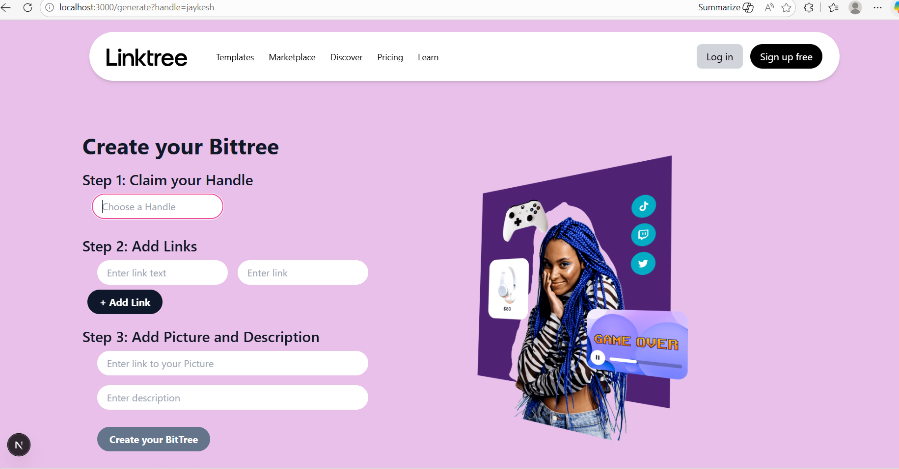
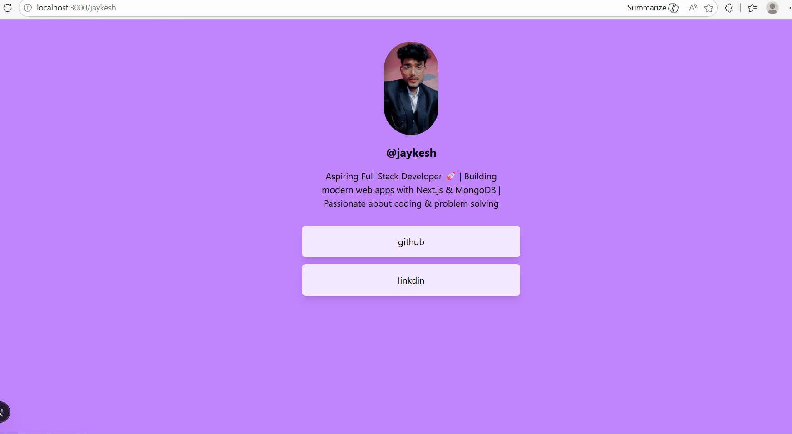

# 🌐 BitTree - Link Sharing Platform

BitTree is a modern Linktree-style web application that allows users to create a personalized page with multiple links, all accessible through a single URL.

##  Live Demo

 https://linktree-self-phi.vercel.app

---

##  Features

*  Create multiple links under one handle
*  Custom profile with image and description
*  Fast and responsive UI (mobile-friendly)
*  Dynamic routing (`/handle`)
*  MongoDB database integration
*  Clean and modern UI with Tailwind CSS

---

## Tech Stack

* **Frontend:** Next.js 13 (App Router), React
* **Backend:** Next.js API Routes
* **Database:** MongoDB Atlas
* **Styling:** Tailwind CSS
* **Deployment:** Vercel

---

## 📸 Screenshots

###  Home Page



### ⚙️ Generate Page



### 🔗 User Page



---

## ⚙️ Installation & Setup

```bash
git clone https://github.com/JAYKESH-KUMAR/Web-Development-Jaykesh.git
cd linktree-clean/linktree-clone
npm install
npm run dev
```

---

## 🔐 Environment Variables

Create a `.env.local` file and add:

```
MONGODB_URI=your_mongodb_connection_string
```

---


---

##  Author

**Jaykesh Kumar**

* GitHub: https://github.com/JAYKESH-KUMAR

---

## ⭐ Support

If you like this project, give it a ⭐ on GitHub!
