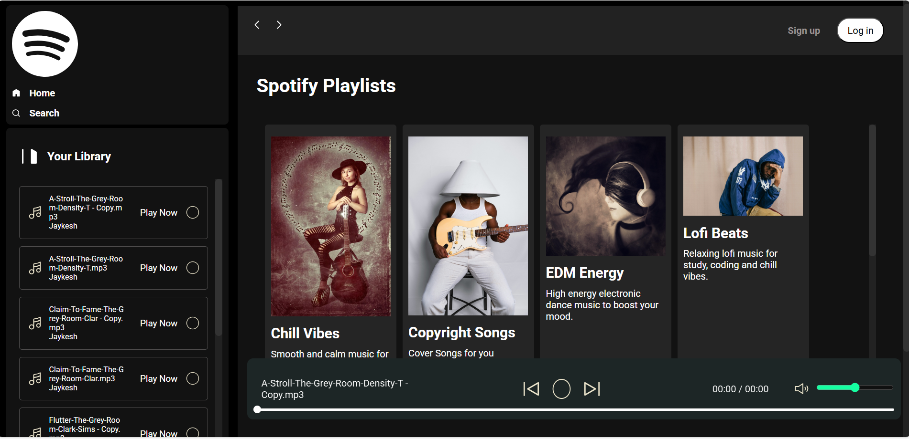

# Spotify Clone 

This is my Spotify UI Clone project which I built while learning Web Development.  
I created this project using HTML, CSS and JavaScript to understand layouts, music cards and basic player interaction.

## Preview

## Features
- Play / Pause button
- Music card layout
- Sidebar navigation
- Hover effects
- Basic music player UI

## Tech Used
- HTML
- CSS
- JavaScript

## Project Purpose
This project is made only for learning and practice.  
I tried to understand how a music streaming interface works and how UI components are structured.

## Live Demo
https://JAYKESH-KUMAR.github.io/Web-Development-Jaykesh/project2-spotify-clone/

Made by Jaykesh Kumar